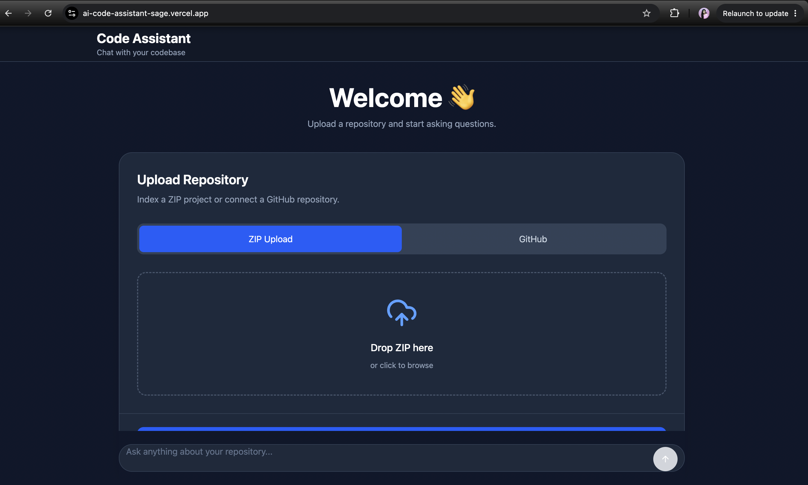
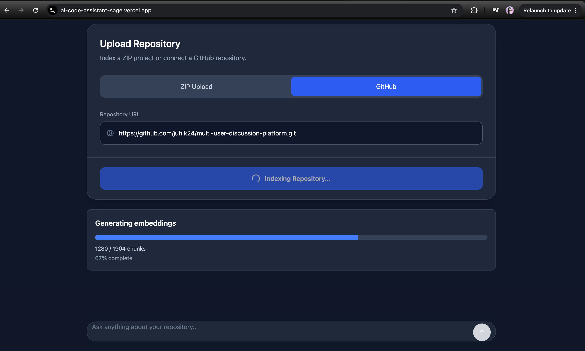
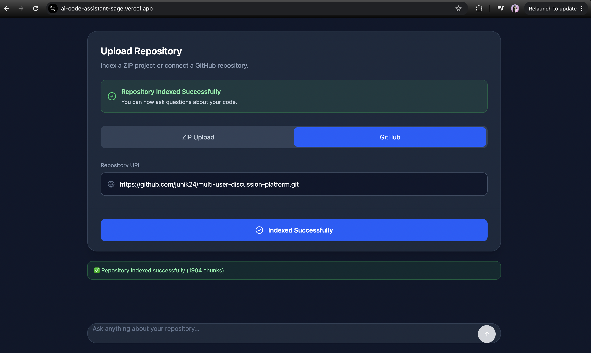
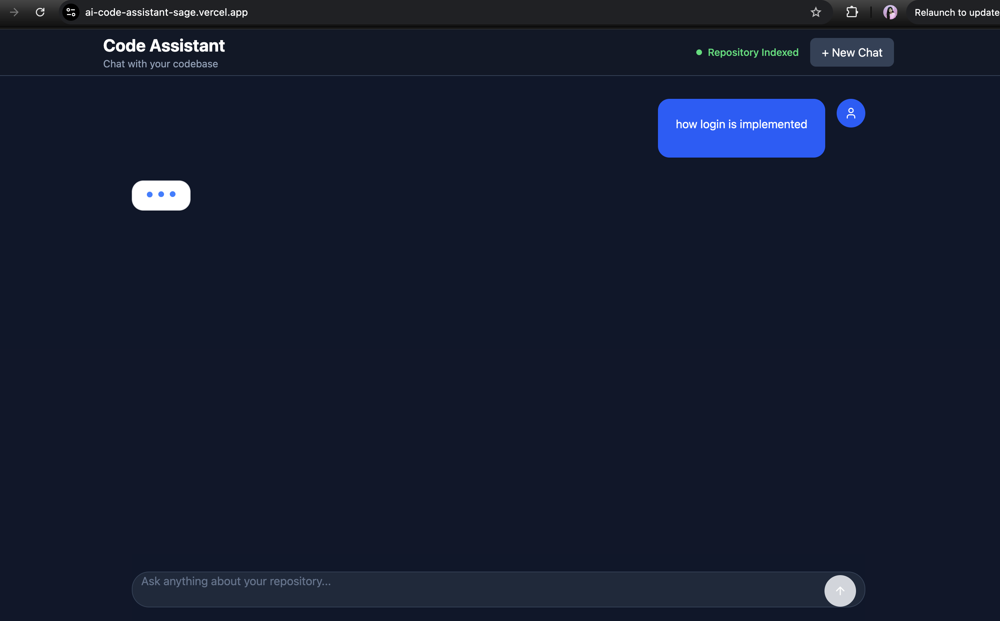
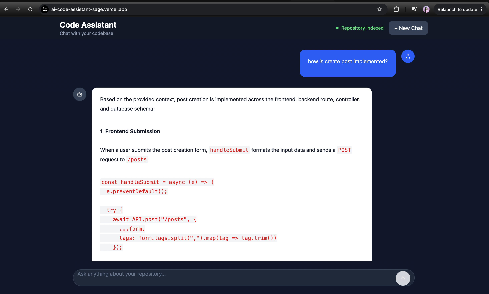

# AI Code Assistant


An AI-powered code assistant that allows developers to upload or import a GitHub repository and ask natural language questions about the codebase. The application indexes the repository using vector embeddings and Retrieval-Augmented Generation (RAG) to provide context-aware answers with source references.

## Key Highlights

- AI-powered code understanding using Retrieval-Augmented Generation (RAG)
- Supports both ZIP uploads and public GitHub repositories
- Real-time repository indexing with live progress updates
- Semantic code search using Jina AI embeddings and ChromaDB
- Source-aware answers generated using Google Gemini
- Built with React, FastAPI, MongoDB Atlas, and ChromaDB
- Fully deployed on Vercel and Render

## Demo

Frontend: https://ai-code-assistant-sage.vercel.app

# **📸 Screenshots**
## Home Page



## Repository Indexing



## Repository Indexed



## Chat Interface



## AI Generated Answer



---

## Tech Stack

### Frontend
- React
- Vite
- Tailwind CSS
- Axios

### Backend
- FastAPI
- Python

### AI & RAG
- Google Gemini API
- Jina AI Embeddings
- ChromaDB
- LangChain Text Splitters

### Database
- MongoDB Atlas

### Deployment
- Vercel (Frontend)
- Render (Backend)

---

## Architecture

```
                +---------------------+
                |  React Frontend     |
                +----------+----------+
                           |
                           |
                     REST APIs
                           |
                           v
                +---------------------+
                | FastAPI Backend     |
                +----------+----------+
                           |
        +------------------+------------------+
        |                                     |
        v                                     v
 Repository Indexing                    Chat Requests
        |                                     |
        |                                     |
        v                                     |
 File Loader                                 |
        |                                     |
        v                                     |
 Document Chunking                            |
        |                                     |
        v                                     |
 Jina Embeddings                              |
        |                                     |
        v                                     |
 ChromaDB Vector Store <----------------------+
        |
        |
        v
 Retrieve Relevant Chunks
        |
        v
 Google Gemini
        |
        v
 AI Response + Source Files

```

---

## Project Structure

```
AI-Code-Assistant/
│
├── backend/
│   ├── app/
│   │   ├── backend/
│   │   ├── database/
│   │   ├── services/
│   │   ├── main.py
│   │   └── ...
│   ├── requirements.txt
│
├── frontend/
│   ├── src/
│   ├── public/
│   └── package.json
│
└── README.md
```

---

## How It Works

### Repository Indexing

1. Upload a ZIP file or GitHub repository URL.
2. Repository files are scanned.
3. Supported source files are loaded.
4. Documents are split into semantic chunks.
5. Jina AI generates embeddings.
6. Embeddings are stored in ChromaDB.
7. Progress is displayed in real time.

### Question Answering

1. User asks a question.
2. Question is converted into an embedding.
3. ChromaDB retrieves the most relevant code chunks.
4. Retrieved context is sent to Google Gemini.
5. Gemini generates an answer using only the retrieved code.
6. The response includes the source files used.


## Installation

### Backend

```bash
cd backend
pip install -r requirements.txt
uvicorn app.main:app --reload
```

### Frontend

```bash
cd frontend

npm install

npm run dev
```

---

## Environment Variables

Backend `.env`

```env
GEMINI_API_KEY=your_gemini_api_key

JINA_API_KEY=your_jina_api_key

MONGO_URI=your_mongodb_connection_string
```

## Future Improvements

- Hybrid Search (Keyword + Vector Search)
- Repository-wide code graph
- Conversation memory across sessions
- Multi-repository support
- Authentication
- Streaming AI responses
- Syntax-highlighted source viewer
- Support for additional programming languages
